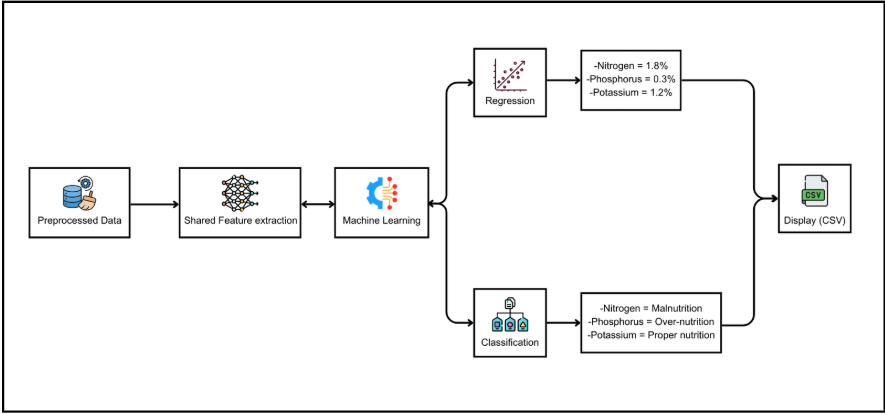
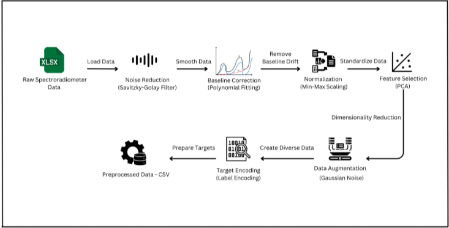
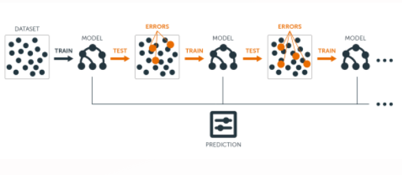
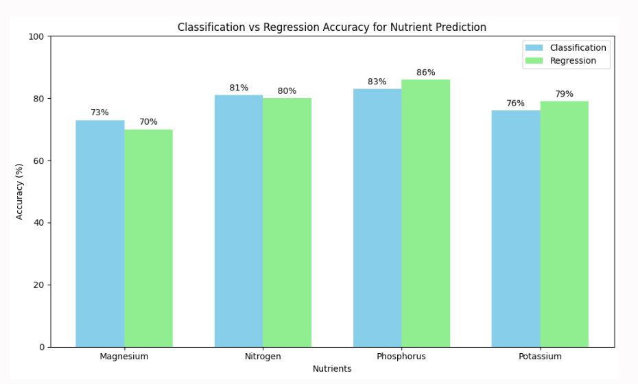

# 🌿 Oil Palm Leaf Nutrient Estimation from Spectroradiometer Data

> 📌 *Advised by Dr. Apichon Witayangkurn*

This project uses spectral data from oil palm leaves to estimate nutrient levels (N, P, K, Mg) using machine learning models. It aims to enhance nutrient monitoring while minimizing fertilizer overuse for sustainable agriculture.

---

## 📚 Table of Contents

- [🌱 Introduction](#-introduction)
- [📁 Dataset](#-dataset)
- [⚙️ System Architecture](#️-system-architecture)
- [🧪 Preprocessing Pipeline](#-preprocessing-pipeline)
- [🤖 Model Training](#-model-training)
- [📐 Design Specification](#-design-specification)
- [📊 Evaluation](#-evaluation)
- [🙏 Acknowledgments](#-acknowledgments)

---

## 🌱 Introduction

Oil palm trees are key sources of palm oil used in food, cosmetics, and biofuels. Nutrients like Nitrogen (N), Phosphorus (P), Potassium (K), and Magnesium (Mg) are essential for healthy growth.

Monitoring these nutrients helps avoid fertilizer overuse and promotes better crop management.

---

## 📁 Dataset

The dataset consists of spectral readings from a **spectroradiometer**, processed and labeled for nutrient estimation tasks.

---

## ⚙️ System Architecture

This system follows a structured ML pipeline from raw data preprocessing to model prediction.

---
## 🧪 Preprocessing Pipeline

### 1. Noise Reduction
- **Savitzky-Golay filter** applied to smooth spectral signals.

### 2. Baseline Correction
- **Polynomial detrending** removes low-frequency baseline.

### 3. Normalization
- **Min-Max scaling** to [0, 1] for consistency.

### 4. Feature Selection (PCA)
- **Principal Component Analysis** reduces dimensionality while retaining 95% variance.

### 5. Data Augmentation
- **Synthetic data generation** via small noise on principal components.

### 6. Target Encoding
- Categorical target labels converted to numeric for ML compatibility.

---

## 🤖 Model Training

### 📎 Data Splitting
- **80/20 split** via `train_test_split()` with **stratification**.

### 🧠 Classification Models (Voting Ensemble)
- `XGBoost`
- `LightGBM`
- `CatBoost`
- `MLPClassifier`

### 📈 Regression Model
- **Gradient Boosting Regressor** for continuous nutrient level prediction.

---

## 📊 Evaluation

### 🔎 Classification Metrics
- Accuracy
- F1-Score

### 🔧 Regression Metrics
- Mean Squared Error (MSE)
- Root Mean Squared Error (RMSE)
- Mean Absolute Error (MAE)
- R-squared

### 📈 Nutrient Prediction Results

| Nutrient   | Classification Accuracy | Regression R² |
|------------|--------------------------|---------------|
| Magnesium  | 73%                      | 70%           |
| Nitrogen   | 81%                      | 80%           |
| Phosphorus | 83%                      | 86%           |
| Potassium  | 76%                      | 79%           |

---

## 🙏 Acknowledgments

Special thanks to **Dr. Apichon Witayangkurn** for guidance and supervision throughout this project.

---
